```
"READ ME FIRST/RENDER ME FIRST:
This README is meant to be rendered by Typora's "Export to PDF" feature.
This file uses custom HTML and custom CSS (see docs_src/base.user.css) for page breaks and custom text styling (in "Acknowledgments").
For my own sake, PLEASE RENDER ME before reading."
-- the guy who wrote this README
```


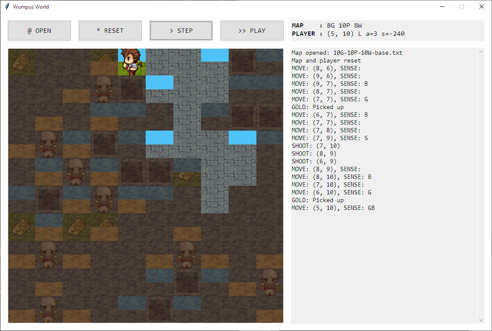

<div style="text-align: center">
    <br><span style="font-size: 3em; font-weight: 700; font-family: Consolas">
        Project 02: Wumpus World
    </span><br>
    <span style="">
        A project for <code>CSC14003</code> "Introduction to Artificial Intelligence" @ 18CLC6
    </span>
</div>

<div style="page-break-after: always"></div>

# About this project

- **Collaborators**:
    - **`18127221` Bùi Văn Thiện** ([@84436](https://github.com/84436)):
      GUI, Maps, Game controller
    - **`18127231` Đoàn Đình Toàn** ([@t3bol90](https://github.com/t3bol90)):
      Agent/Player/Logic core, Game controller, Bugfixes
- **Software stack** used in this project:
    - Language: Python3
    - External libraries: `Tkinter` (GUI), `python-SAT/Glucose3` (Logic)
    - IDE: VSCode
- **Progress** (on the scale of `1.00`):
    - `1.00` Main + GUI (Tkinter)
    - `1.00` Map 
    - `1.00` Map utilities (generator, checker)
    - `1.00` Game controller
    - `1.00` Player/Logic core


*Note: the word "Agent" and "Player" will be used interchangably in this report from this point onward.*

<div style="page-break-after: always"></div>

# Quick start

1. **Prepare**
    Make sure all external libraries are installed.
2. **Run**
    Run `main.py`
3. **Load map**
   The main GUI window will open with no maps preloaded. To load a map, click <kbd>@ OPEN</kbd>.
4. **Control**
    <kbd>> STEP</kbd> or <kbd>>> PLAY</kbd> through the map, then <kbd>* RESET</kbd> or open another map once the game is over.

<div style="page-break-after: always"></div>

# `main.py`

This file…

- **is the starting point of the program.** It creates an instance of **Controller** and `.start()` it.
- provides parameters ("configurables") for tweaking the program, constants (for layout/geometry) and messages for GUI, and directory paths, as following

| Parameter           | Default value                    | Description                                                  |
| ------------------- | -------------------------------- | ------------------------------------------------------------ |
| `ASSET_THEME`       | `thiagodnf`                      | Theme/Set of textures used for map drawing. This should be a folder name in the asset directory. |
| `TILES_SHOW_HIDDEN` | `True`                           | If `True`, the "hidden tile" texture with partial transparency (`tile_hidden_alpha80.png`) will be loaded instead of the usual hidden tile. This helps show |
| `WINDOW_TITLE`      | `Wumpus World`                   | Window title                                                 |
| `FONT`              | `Consolas`                       | Font used in the whole GUI. `Consolas` is a default monospace font available in Windows. |
| `AUTOSTEP_DELAY`    | `100`                            | Delay between steps in "Autoplay mode", activated by <kbd>>> PLAY</kbd> button. |
| `KEYB_OPEN`         | `z`                              | Keyboard shortcut for <kbd>@ OPEN</kbd>                      |
| `KEYB_RESET`        | `x`                              | Keyboard shortcut for <kbd>* RESET</kbd>                     |
| `KEYB_STEP`         | `c`                              | Keyboard shortcut for <kbd>> STEP</kbd>                      |
| `KEYB_AUTOSTEP`     | `v`                              | Keyboard shortcut for <kbd>>> PLAY</kbd>                     |
| `BASE_DIR`          | {see `main.py`}                  | Base directory. This directory is expected to contain both `MAPS_DIR` and `ASSETS_DIR`. |
| `MAPS_DIR`          | `maps/` from `BASE_DIR`          | Directory for containing mapfiles.                           |
| `ASSETS_DIR`        | `assets/{theme}` from `BASE_DIR` | Directory for containing assets for a theme (specified by `ASSET_THEME`) used in map drawing. |
| `ONBOARDING_MSG`    | {see `main.py`}                  | Tuple of 2 strings used as welcome message on the GUI on program's first launch. |

<div style="page-break-after: always"></div>

# `gui.py`: GUI

This module provides a GUI for this program.


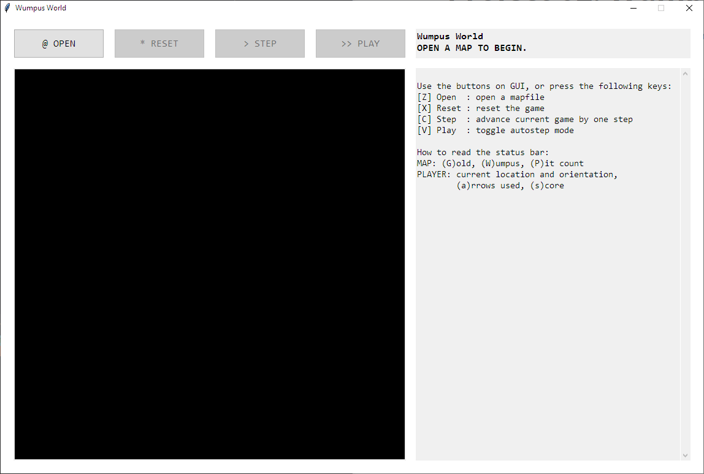
> Figure: Wumpus World GUI on first launch


The GUI is divided into 4 main parts. In clockwise order:

- **Status**: Show the current status of map and player.
    - Status of map: number of Gold, Wumpus and Pit left
    - Status of player: current location, orientation, number of arrows used, and score
- **Log**: Log simple map- and player-related events.
    - This log will be cleared on every map open.
- **Canvas**: Show a graphical representation of the current map.
    - Currently it only shows maps of size $10 \times 10$ maximum.
- **Buttons**: Buttons for controlling the game.
    - <kbd>@ OPEN</kbd> (default shortcut key: <kbd>Z</kbd>): open a mapfile.
    - <kbd>* RESET</kbd> (default shortcut key: <kbd>X</kbd>): reset the current map and player.
    - <kbd>> STEP</kbd> (default shortcut key: <kbd>C</kbd>): advance the current game state by one step.
    - <kbd>>> PLAY</kbd> (default shortcut key: <kbd>V</kbd>): toggle autostep mode.


This module also provides methods for manipulating part of the GUI:

- `map_open_dialog` for calling the system native "Open file" dialog to choose a mapfile
- `status_update` and `canvas_update` for updating the status and canvas based on the current map.
- `log_write` and `log_clear` for writing/clearing the log.
- `game_*` for reflecting the current/corresponding game state onto the GUI.


A number of callbacks and a "location invert helper" (`loc_invert_helper`) is needed to properly initialize this module.

- The list of callbacks are mentioned in the **Controller** description below.
- The coordinates of items in map is represented as an index of a 2D array, with `(0,0)` as the top–left corner, and `(9,9)` as the bottom–right corner (assuming a $10 \times 10$ map.) In order to be compliant to the program requirements given in the original problem statement (`(1,1)` at **bottom**-left and `(10,10)` at **top**-right), `loc_invert_helper` is needed to "invert" the coordinates shown on the screen.


One notable thing is that the Log _does not_ provide KB deltas and everything underneath the logic core; they are instead shown in a separate terminal.

<div style="page-break-after: always"></div>

# `map*.py`: Map & map utilities

### About `map.py`

This module (`map`) provides methods for…

- Maps: parsing, storing (in simple 2D array of strings) and manipulating based on player's action
- Players: stats (current location, numbers of arrows used and scores), scoring rules and actions to manipulate map (look around, move, shoot, grab gold, and leave the cave)


### About utilites

Two utilities are provided to ease map designing and fixing. They are standalone and do not require any modules in the main program (not even Map.)

- Map generator (`map_generator.py`) randomly generates maps based on a given map size (currently fixed to 10) and number of items (pit/wumpus/gold) in the map.
- Map checker (`map_checker.py`) fix a given mapfile to make it readable to the Map module.


### Map format

There are two map formats (actually three) supported in this program.

- The original format as given by the problem description: each empty tile is denoted by a hyphen `–`.
- `compact`: each empty tile has nothing in between.
- `readable`: paddings using hyphens `–` are added to each empty tiles so the width of each tile appeared in the text file is the same. This makes the mapfile itself more human-readable.

Map generator provides a parameter, `gen_format`, for choosing between this "new" format (`readable`) and the original format (`compact`). Map checker, however, currently enforces the new `readable` map, with no overriding parameters.

To demonstrate, here's a sample map (`Figure1.txt`) in 3 format:

<table>
    <tr style="font-family: monospace">
        <td><pre>
10
G.G..B.P.B....
G.G.S.B.P.B..G..
.SB.W.SB.P.B....
B.P.SB..B.....
P.B........
B.....B....
....B.P.B...
.....B.G.B..
......B.P.B.
A.......B..
        </pre></td>
        <td><pre>
10
G.G.-.B.P.B.-.-.-.
G.G.S.B.P.B.-.G.-.
.SB.W.SB.P.B.-.-.-.
B.P.SB.-.B.-.-.-.-.
P.B.-.-.-.-.-.-.-.
B.-.-.-.-.B.-.-.-.
.-.-.-.B.P.B.-.-.
.-.-.-.-.B.G.B.-.
.-.-.-.-.-.B.P.B.
A.-.-.-.-.-.-.B.-.
        </pre></td>
        <td><pre>
10
-G.-G.--.-B.-P.-B.--.--.--.--
-G.-G.-S.-B.-P.-B.--.-G.--.--
--.SB.-W.SB.-P.-B.--.--.--.--
-B.-P.SB.--.-B.--.--.--.--.--
-P.-B.--.--.--.--.--.--.--.--
-B.--.--.--.--.-B.--.--.--.--
--.--.--.--.-B.-P.-B.--.--.--
--.--.--.--.--.-B.-G.-B.--.--
--.--.--.--.--.--.-B.-P.-B.--
-A.--.--.--.--.--.--.-B.--.--
        </pre></td>
    </tr>
    <tr style="text-align: center">
        <td>Compact</td>
        <td>Original</td>
        <td>Readable</td>
    </tr>
</table>

All maps provided in `maps/` are in the `readable` format.

<div style="page-break-after: always"></div>

# `controller.py`: Controller

This module acts as a middle layer gluing **GUI**, **Map** and **Agent** together. It does the following things:

- Create an instance of GUI, Map and Agent
- Provide callbacks for GUI so they can be bound to certain buttons and subroutines invoked by the GUI. These callbacks include:
    - `cb_map_get`: Provide the current Map object for GUI (to redraw screen, update status and logs)
    - `cb_map_open`: Handle map opening (by replacing the current Map object with a new one, with path to mapfile given by the system's "Open file" dialog.)
    - `cb_reset`: Reset Map and Agent (by calling their corresponding `.reset()` methods)
    - `cb_step`: Forward current game state by one step, then handle Agent's request and game-ending condition checks
- Handle the game flow (as hinted by the `cb_step()` method.)

<div style="page-break-after: always"></div>

# `logic_random.py`: Agent

_**NOTE**: The name of this module is a misnomer; this module was originally intended to provide only a dumb agent that can only move randomly (hence the name `logic_random`) to assist in writing the interface of Controller and debugging GUI._

This module provides two agents (called "Players") for solving the game.


### "Dumb" agent

This is a simplistic agent that has limited memory (and only for a specific purpose; see below) and limited capability of reacting to the environment ("simple reflex").

- Whenever it sees gold, it will pick up (obviously);
- Whenever it senses stench, it will remember the adjacent locations (maximum of 4) and shoot at each location on each agent's call;
- Otherwise, it will pick a random direction to move to.


### "Smart" agent (that actually works)

The Logic core is built using **Glucose3** solver provided by `python-SAT`.

In this project, the Agent can be implement by using First Order Logic (FOL)– or Propositional Logic (PL)– Resolution. In a quick survey, we understand the concept of FOL and PL and it's advantages/disadvantages.


| Properties       | FOL                                                          | PL-Resolution                                            |
| ---------------- | ------------------------------------------------------------ | -------------------------------------------------------- |
| Implementation   | Hard<br />(Re-implementation of clause parser, entailing, etc. is required.) | Quick and easy                                           |
| Performace       | Normal                                                       | Normal — but it's will be slower than FOL in large space |
| Correctness      | ✅ Yes                                                        | ✅ Yes                                                    |
| Space Complexity | Small                                                        | Large                                                    |

Since we are on a tight time budget, we decided to build the agent's logic core/KB following the PL–Resolution method.

With Glucose3 model, the KB is much simpler. KB is a set of clauses as a `CNF` form. The model will solve it and return the answer of a 200–variable equation (200 because – assuming the map is $10 \times 10$ – it's 100 tiles + 100 Wumpus' clusters + 100 Pits' clusters.)


Our strategies are:

- Finish the game by going through all of safe cells in the map.
- Kill Wumpuses with the least shoots, depend on what KB entailed.
- Collect all the gold from the safe cells.

> There's nothing special here :>. It's just an agent, it finishes the game successfully. The most surprising thing to us is that our agent can think and returns the right decisions. We use the term 'right' but not 'good' because if you are a human, you can 'feel' that sometimes our score is enough to give up. But our agent will neva give up till it can not entail a safe cell to go; after all that it then climbs out of the cave. 


There are some emergent behaviors we get from our agent:


##### Naruto[^1] case

If you shoot the Wumpus, it still unsafe because the Breeze tell us that there is a Pit. But, if you shoots the Wumpus successfully, it's a safe cell


| 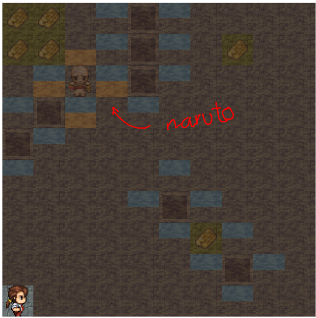 |         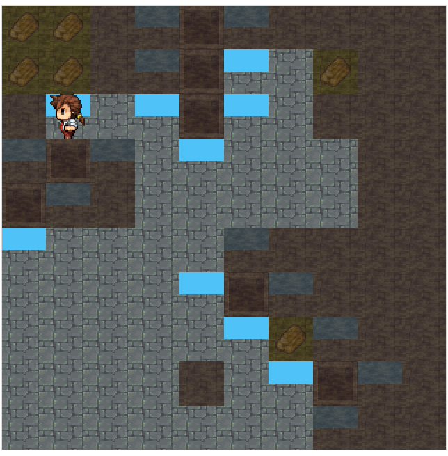          |
| :----------------------------: | :---------------------------------------------: |
|        **Naruto case**         | **Our agent pass Naruto and collect the golds** |


##### Risky case

When there are no safe cells, the agent decide to get out the cave - it's a risky move if you try to get the remaining gold. 


| 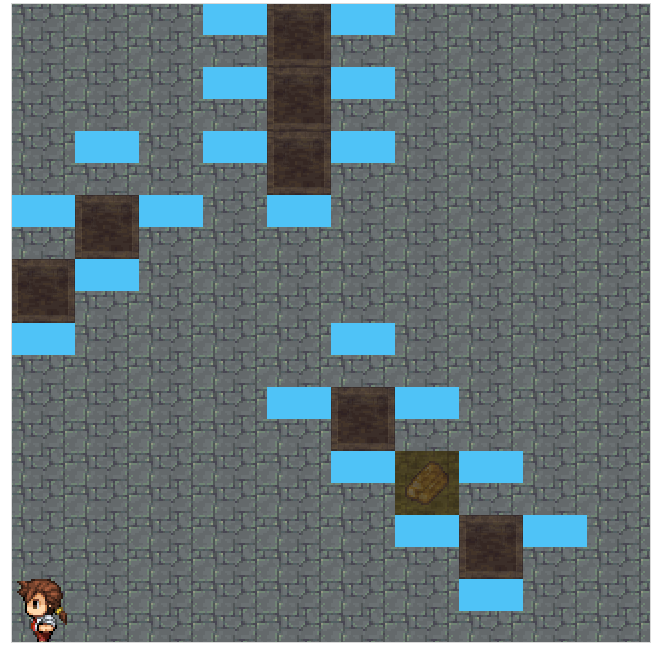 |
| :--------------------------------------------------------: |
|                       **Risky case**                       |


Our program will output the KB as a list of variables' cluster value (there's 200 of them):

|  |
| :----------------------------: |
|       KB in the terminal       |

<div style="page-break-after: always"></div>

# Sample runs

| 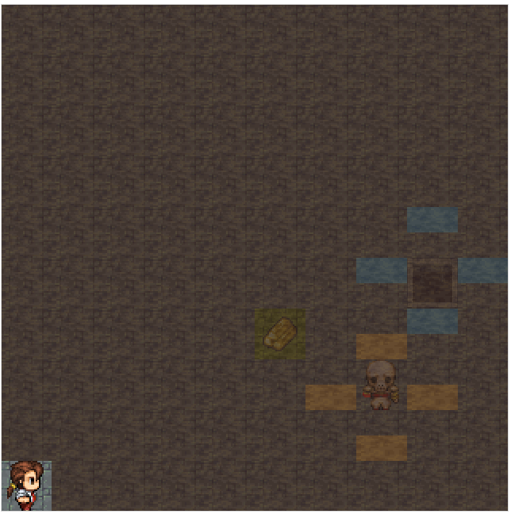 | 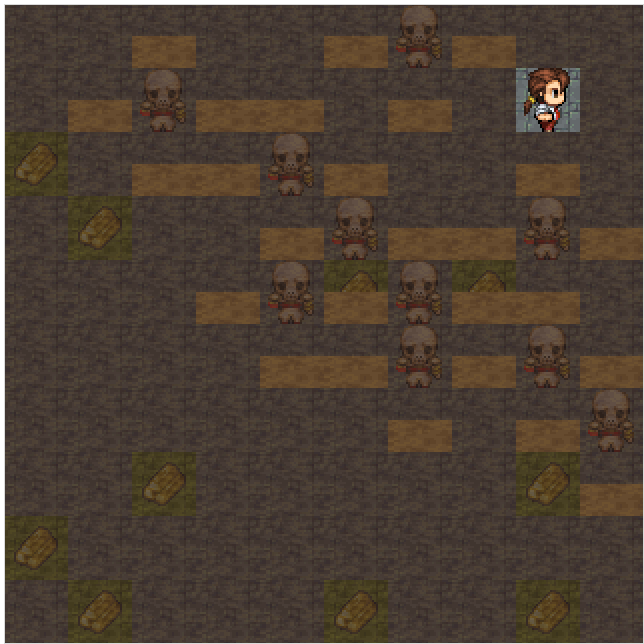 | 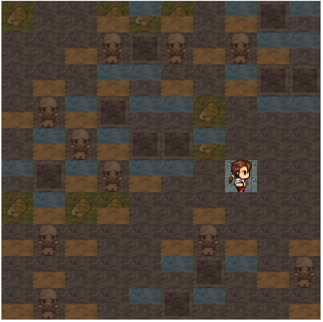 |
| :----------------------------: | :----------------------------: | :----------------------------------------------------------: |
| Simple map | Wumpus and Gold only |                A complex map with lots of wumpuses, pits and Naruto cases                |
|                      | 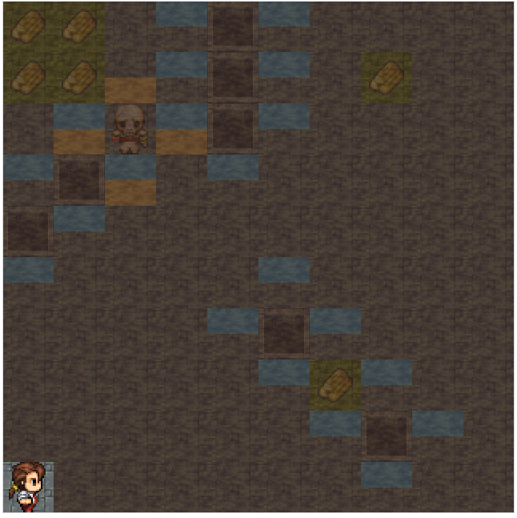 | 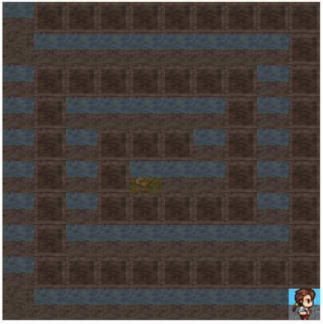 |
| Gold blocked | **Figure 1** |                Pit Maze                |
|                    | 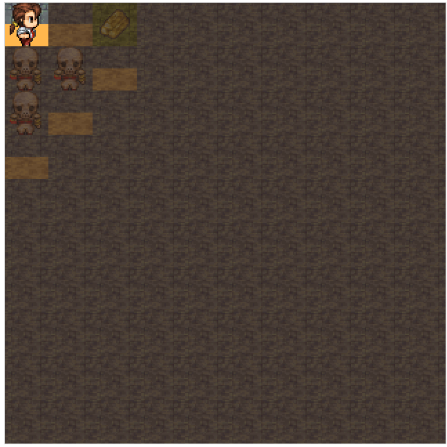 |                           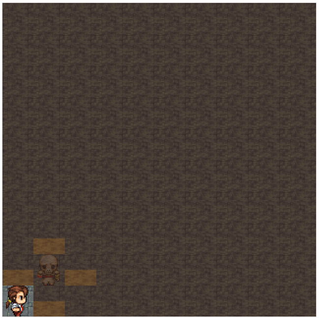                           |
| Wumpus Maze | Optimal shoots | Bias test |
> This project challenge our patience and creating an environment where we aren’t only allowed to succeed but also to fail. But our Agent won't fail :100:. Where there is a will, there is a way. A way for our Agent finish the game.

<div style="page-break-after: always"></div>

# <span style="display: none">Acknowledgments</span>

<div style="font-family: Cambria; font-size: 3em; font-style: italic; text-align: center; font-weight: 700">
— Acknowledgments —
</div>
<div style="font-family: Cambria; font-size: 1.25em; font-style: italic; text-align: center">
<p>
To all teacher assistants of this course,
</p>
<p>
We would like to thank you for this semester, especially in this course. For your patience and for creating an environment where we aren’t only allowed to succeed but also to fail, for replying every questions of us. Students succeed when students feel the freedom to imagine and trust you give ★.
</p>
<p>
This class was challenging at times but there was value in being exposed to the material. And this project is really challenging at all. But with all of our efforts, teamwork spirit and all of your supports, we did it.
</p>
<p>
At the end, we would like to acknowledge support for this project by my teachers at University of Science — VNU. Special thanks to our seniors at University of Science for providing insights and expertise that helped us finish this project.
</p>
<p>
Thanks to our teammates, we did it! Together.
</p>
<p style="color: #808080">
—— Toàn Đoàn (and Văn Thiện) (but mostly Toàn Đoàn)
</p>
</div>

<div style="page-break-after: always"></div>

# References

- Standard Python docs for `Tkinter` (GUI) and `python-sat/Glucose3` (Logic)
- [GitHub: `thiagodnf/wumpus-world-simulator`](https://github.com/thiagodnf/wumpus-world-simulator): assets for map drawing
- Countless StackOverflow threads about everything
- That star ★ in the **Acknowledgment**:
    [Milrad, Marcelo. (1999). Designing an Interactive Learning Environment to Support Children's Understanding in Complex Domains.](https://www.researchgate.net/publication/2375285_Designing_an_Interactive_Learning_Environment_to_Support_Children%27s_Understanding_in_Complex_Domains) 


[^1]: We call that is Naruto case because there are a bunch of fake unsafe cells, but if you shoot the right cell, it will disappear – just like Naruto and his clones when he use 分身の術 (Kage Bunshin no Jutsu – "The Art of Doppelganger".)
